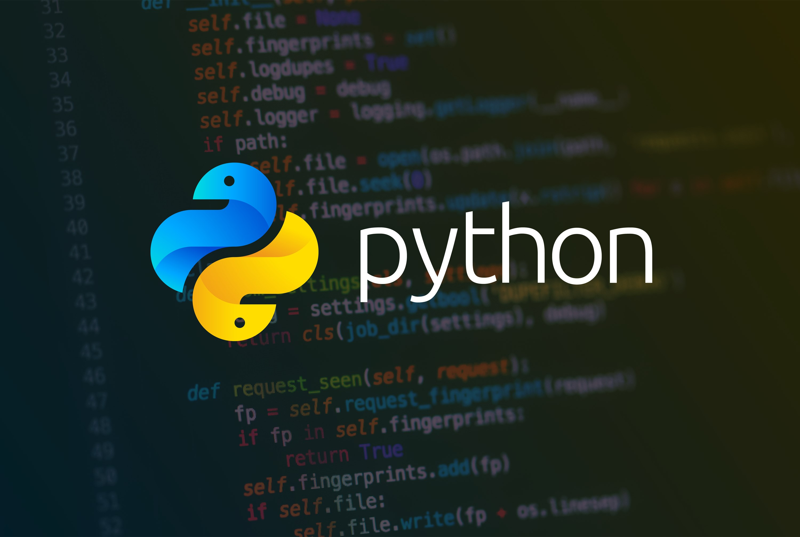

# История создания Python
## Введение
Язык программирования Python создан голландским программистом Гвидо ван Россумом в конце 1980-х годов. Работа над проектом началась в декабре 1989 года как проект для заполнения свободного времени во время отпуска.
## Идея создания
Цель ван Россума — создать простой и понятный язык программирования, который бы сочетал простоту ABC с мощностью и гибкостью традиционных языков. Он стремился сделать язык таким, чтобы программисты могли легко и быстро разрабатывать решения, не сталкиваясь с лишними техническими трудностями.
## Разработка
Первый прототип будущего Python состоял из простой виртуальной машины, парсера и среды выполнения. В нём также присутствовал базовый синтаксис, операторы, словари, списки, строки и небольшое количество других типов данных.
20 февраля 1991 года Гвидо ван Россум создал дистрибутив и опубликовал код языка Python через сеть Usenet — так появилась версия 0.9.0. Уже на этом этапе язык включал многие ключевые особенности: чистый синтаксис с отступами для обозначения блоков кода, объектно-ориентированное программирование с наследованием и полиморфизмом, обработку исключений для управления ошибками, встроенные типы данных (строки, списки, словари).
## Версии
Долгое время параллельно существовали две основные версии: Python 2.x и Python 3.x. Python 2.x не поддерживается официально с января 2020 года, но многие старые проекты всё ещё используют эту версию. Python 3.x активно поддерживается и развивается, современные библиотеки и фреймворки ориентированы на эту версию. Некоторые различия между версиями:
- Синтаксис вывода: в Python 3 print — функция, что делает синтаксис более явным.
- Работа со строками и Unicode: в Python 3 все строки по умолчанию представлены в формате Unicode, в Python 2 требовалось явно указывать Unicode-строки.
- Итераторы и генераторы: в Python 3 функции, возвращающие списки (например, range(), map(), filter()), возвращают итераторы, что позволяет экономить память и повышает производительность.
## Популярность
Со временем Python стал популярным среди разработчиков благодаря своему лаконичному синтаксису, богатой стандартной библиотеке и активной поддержке сообщества.

